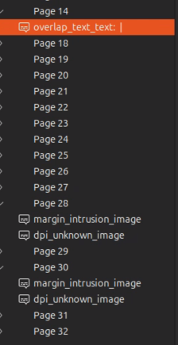
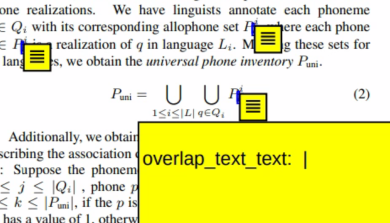
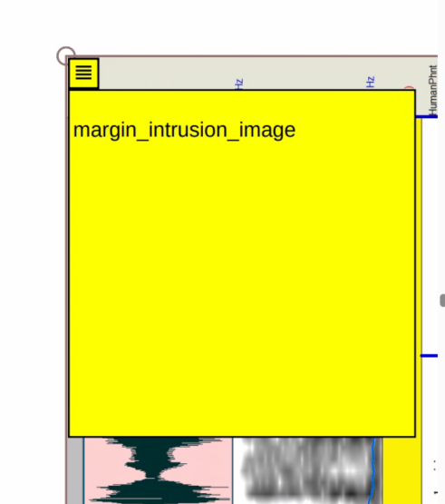

# PDF Validator

A deterministic PDF validation tool that checks for common document quality issues using PyMuPDF (MuPDF).

## Overview

PDFValidator is a Python utility that analyzes PDF documents for potential printing and publishing problems. It performs comprehensive checks to ensure PDFs meet professional standards for text layout, image quality, font embedding, and page structure.

## Features

The tool performs the following validation checks:

- **Margin Intrusions**: Detects text or images that are too close to page edges
- **Content Overlaps**: Identifies overlapping text spans and text over images
- **Font Embedding**: Verifies that all fonts are properly embedded
- **Image Quality**: Checks for low-DPI images that may print poorly
- **Page Structure**: Validates page box relationships (CropBox vs MediaBox)

## Examples

### List of Comments
Annotations are added as comments can can be browsed in your PDF reader.


### Overlapping Text
Here is an example of potentially overlapping text.


### Image Out of Boundaries
Here is an examplt of an image overflowing the margins.



## Installation

### Requirements

- Python 3.x
- PyMuPDF (fitz)

```bash
pip install PyMuPDF
```

## Usage

### Basic Validation

```bash
python pdfval.py document.pdf
```

### Advanced Options

```bash
python pdfval.py document.pdf \
  --margin-pts 36 \
  --dpi-threshold 300 \
  --annotate annotated_output.pdf \
  --json validation_report.json
```

### Command Line Arguments

- `pdf`: Input PDF file to validate (required)
- `--margin-pts`: Margin threshold in points (default: 36.0, equivalent to 0.5 inches)
- `--dpi-threshold`: Minimum acceptable DPI for images (default: 300)
- `--annotate`: Generate an annotated PDF showing detected issues
- `--json`: Export detailed validation report to JSON file

## Output

### Console Output

The tool prints a summary of validation results:

```json

  "total_issues": 41,
  "pages_with_issues": 24,
  "ok": false
```


### JSON Report Format

When using `--json`, generates a detailed report including:

- File information and validation parameters
- Page-by-page issue breakdown
- Bounding box coordinates for each issue
- Issue type classification and descriptions
- Summary statistics

### Annotated PDF

When using `--annotate`, creates a visual representation of issues with:

- Color-coded rectangles highlighting problem areas
- Text annotations describing each issue
- Different colors for different issue types

## Issue Types

| Issue Type | Description | Visual Indicator |
|------------|-------------|------------------|
| `margin_intrusion_text` | Text too close to page edges | Red rectangles |
| `margin_intrusion_image` | Images too close to page edges | Red rectangles |
| `overlap_text_text` | Overlapping text spans | Blue rectangles |
| `overlap_text_image` | Text overlaying images | Purple rectangles |
| `low_dpi_image` | Images below DPI threshold | Orange rectangles |
| `dpi_unknown_image` | Images with undetectable DPI | Gray rectangles |
| `font_not_embedded` | Non-embedded fonts | Black annotations |
| `page_box_error` | Page structure issues | Black annotations |

## Example Usage

### Validate with custom margins
```bash
python pdfval.py research_paper.pdf --margin-pts 54  # 0.75 inch margins
```

### Generate annotated PDF for review
```bash
python pdfval.py document.pdf --annotate reviewed_document.pdf
```

### Full validation with reporting
```bash
python pdfval.py publication.pdf \
  --margin-pts 36 \
  --dpi-threshold 300 \
  --annotate publication_annotated.pdf \
  --json publication_report.json
```

## Technical Details

### Margin Detection
- Creates margin zones based on specified point values
- 72 points = 1 inch
- Default 36pt = 0.5 inch margins

### Overlap Detection
- Uses Intersection over Union (IoU) thresholds
- Text-text overlap: 8% IoU threshold
- Text-image overlap: 2% IoU threshold

### DPI Estimation
- Analyzes image transformation matrices
- Calculates placed pixels-per-inch from scaling factors
- May not detect native image resolution for all PDF types

### Font Embedding Check
- Queries PDF resource dictionary for font information
- Heuristic approach - not perfect for all PDF variations
- Reports fonts that appear to be non-embedded

## Limitations

- DPI detection depends on PDF structure and may not work for all image types
- Font embedding detection is heuristic-based
- Very large PDFs may require significant processing time
- Overlap detection is O(n²) for text spans per page

## Repository Contents

- `pdfval.py`: Main validation script
- `out.json`: Sample validation report
- `annotated.pdf`: Example annotated output
- Sample PDF files for testing

## License

This project is provided as-is for PDF quality validation purposes.